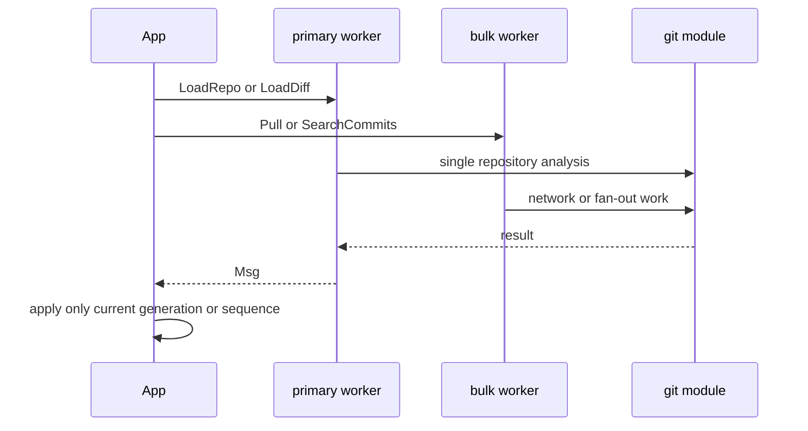

# Background work and result consistency

`App::new` creates two unbounded job channels and calls `spawn_worker` twice. `Job` and `Msg` in `src/app/types.rs` are the explicit asynchronous contract; `src/app/worker.rs` performs Git calls and sends results back; `App::drain_messages`/`apply_msg` applies them on the UI thread.

The separate queues prevent long network/fan-out jobs from blocking single-repository inspection.

## Queue policy and stale results

`Job::is_secondary_worker` routes `Pull`, `Fetch`, `SearchCommits`, and `LoadGlobalMembers` to `bulk_tx`. These can execute one operation per repository or wait up to the network timeout. Repo, file, diff, blame, preview, stash, and branch-log work uses the primary worker.

Home reloads carry `generation`; `refresh_home` advances the atomic generation, while the worker drops queued older `LoadHome` jobs before analysis and `apply_msg` ignores stale replies. Diff, blame, files, and commit metadata carry `diff_seq`; previews and search have independent sequences; global members have `global_gen`. A result must not overwrite a newer screen selection. `RepoLoaded` additionally checks its repository index.

`App::busy` is a per-repository `Activity` map, not a counter: `send_job` records `LoadHome`, `Pull`, and `Fetch`; `apply_msg` removes the marker before stale-result guards, since an obsolete job has still ended. A successful pull/fetch may immediately queue `LoadHome`, changing its marker to Refresh rather than briefly reporting idle. Screen-owned loading flags (repo, diff, blame, search, global members) join the title-bar count. The elapsed-time spinner is presentation, but this lifecycle is owned here and rendered by [presentation](../presentation/ui-and-localization.md).

Acceptance is stateful, not merely a guard: accepted `DiffLoaded` always clears `loading`; success replaces lines and recomputes hunks (optionally restoring density-toggle scroll), while error clears pending restore, lines/hunks, and resets the hunk index. Accepted blame clears `blame_loading`, setting entries on success or clearing blame and reporting error on failure. Metadata/file-list errors clear diff loading and install the diff error; successful lists then initiate the selected-file load. Accepted search clears its loading flag, replaces hits and selection, and surfaces failed repositories separately. Preview accepts only the newest sequence and deliberately falls back to empty header/files on its individual errors. `HomeLoaded` reclamps `home_selected` after a row update can shrink the filtered set.

`load_repo` establishes partial-list semantics: `get_summary` is mandatory, but commits/branches/tags/stashes/files/contributors/worktrees are each converted through `split_list` into an empty list plus a per-list error. Do not turn a failed optional list into a failed snapshot.

## Cache lifecycle

`load_home_cache`/`save_home_cache` persist each `HomeRow` as `home-*.json` before the initial refresh is queued, so the dashboard can show a possibly stale row immediately; corrupt JSON is ignored and `HomeRow` uses serde defaults for older cache schemas. Each refresh replaces its row cache, and repository removal deletes both Home and TUI cache files. `load_tui_cache`/`save_tui_cache` use the separate per-repository `tui-*.json` cache from [`configuration`](../configuration/persistence.md). Cache version must equal 1. It retains summary, commits, branches, tags, stashes, contributors, and worktrees, but intentionally excludes working-tree files and all transient list errors. Fresh `RepoLoaded` saves the successful snapshot.

Search has caps of 50 hits per repository and 300 total, newest date first. Failures are returned separately from empty matches. Global-member aggregation initializes registered members, merges per-repo contributors, sorts each contribution list by commit count, then sorts members active-first, total commits descending, latest date descending.

## Validation

`src/app/tests.rs` covers stale index protection, list clamping, diff/hunk reload behavior, resolver behavior, worker helpers, cache compatibility, and `activity_lifecycle` (success handoff, failure, stale completion, duplicate completion, and independent repositories). `src/ui.rs:activity_tests` verifies rendered activity labels, count, and spinner width. Run `cargo test --lib app::tests` for this layer and `cargo test --all-targets` for real-Git integration. For a new job, update both enums, worker match, dispatch choice, message application guard, activity lifecycle when it is attributed to a repository, and the narrow stale-result test.
