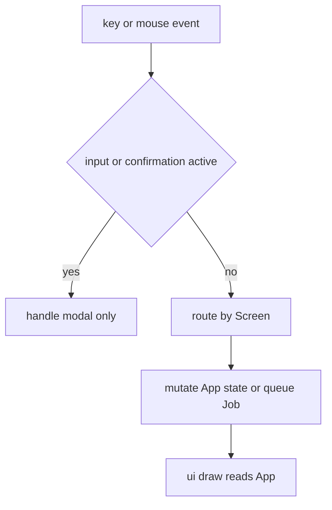

# Navigation and interaction state

`src/app/mod.rs` defines `App`, the single mutable UI state owner. `Screen` in `src/app/types.rs` selects Home, Repo, Diff, Settings, GlobalMembers, RepoFinder, CommitSearch, Help, or Log. `src/lib.rs` forwards press and mouse events to `App`; `src/ui.rs` renders that state without owning it.

## State model and ordering

`RepoTab` is the seven-tab repository detail cycle: Status, Commits, Branches, Tags, Stash, Contributors, Worktrees. `FocusPane` cycles List/Hunks/Content for diffs and is also reused for global-member panes. `DiffView` holds selected file, flattened lines, hunk boundaries, scroll, optional blame, loading/error state, and the sequence-sensitive reload state.

Input (`InputKind`) and `Confirm` are modal state. Mouse clicks return immediately while an input or confirmation is active; this prevents a background table click from mutating selection behind a prompt. Tab switching goes through `switch_tab`, resetting list selection and filters; helpers such as `clamp_index` prevent a changed filtered list from leaving a dead cursor. `handle_mouse_click` maps Home rows through renderer-recorded `home_offset` and detail-list rows through `ListViewport`, not raw screen rows. The renderer must remain the source of these hit-test bounds because Ratatui chooses scroll offsets while drawing.

This is the input precedence implemented across `src/app/mod.rs` and `src/app/handlers.rs`.

## Important navigation contracts

- `open_repo_state`/`open_repo` select a registered index and load cached then fresh repository data. A later `RepoLoaded` applies only if `repo_index` still matches.
- Commit/tag selection records base and target; clicking the `[ ]` marker has the same base → target → unmarked cycle as Space, while clicking elsewhere selects and clicking an already selected row activates it. `ListViewport` keeps this correct after scroll. Opening a diff delegates data loading to [`background work`](background-work.md). `FocusPane::next` skips Hunks when none exist.
- Help retains `help_return`; Escape/back returns appropriately and clears errors before normal navigation.
- Finder input has its own filter/path prompt state. Settings owns repository/member sub-tabs and persists mutations through guarded config writers.
- `t` is context-sensitive: it toggles member activity on contributor screens, otherwise requests a local shell. The actual process boundary is documented in [architecture](../architecture/overview.md).

## How to extend safely

Adding a screen means extending `Screen`, `ui::draw` dispatch, keyboard routing in `App`, mouse behavior when applicable, footer/help hints, and back-navigation semantics. Adding a repository tab also changes `RepoTab::all`, digit mapping, UI tab layout, `selected_item_index`, selection reset, and snapshot data/loading if it has a new data source.

Focused assertions live in `src/app/tests.rs`: modal/routing behavior, selection clamping after filtered Home changes, stale search-hit index rejection, mouse tab reset, hunk synchronization, and external diff command resolution. Rendered hit-target coverage is in `src/ui.rs:commit_click_tests`, including marker geometry, repeated-click clearing, scroll offsets, and tab-bar precedence. Use `cargo test --lib app::tests`; run `cargo test --all-targets` when a change reaches Git or integration behavior.
