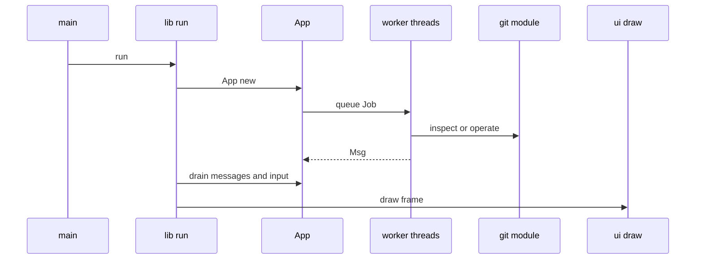

# Runtime architecture and process boundaries

`src/main.rs` handles `-h`/`--help` and `-V`/`--version` before terminal initialization, rejects an unrecognized first argument with exit status 2, and otherwise calls `git_dashboard_tui::run()`. That preserves scriptable release/installer checks when stdout is not a terminal. `run` in `src/lib.rs` owns the terminal lifecycle, while [`App`](../application/navigation.md) owns mutable interaction state and [`crate::git`](../git/engine.md) owns all Git CLI work. Rendering is read-only through `ui::draw`.

This shows the UI-thread/worker split established by `src/lib.rs`, `src/app/mod.rs`, and `src/app/worker.rs`.

## Terminal and event loop

`run` installs a panic hook that disables mouse capture and calls `ratatui::restore`, enables mouse capture, initializes Ratatui, creates `App`, then enters `event_loop`. Each 100 ms tick drains completed messages, considers Home-only auto-refresh, handles a pending external program or shell, draws, and dispatches only key press events plus mouse events. Normal exit calls `leave_tui` and `ratatui::restore`.

Do not move Git work into this loop. `App::new` creates a primary and a bulk channel/workers; queue ownership and stale-result rules are documented in [background work](../application/background-work.md).

## Shell and external-diff boundary

This is separate from Git command hardening. `App` requests a shell via `pending_terminal` or a configured diff via `pending_external`; `event_loop` consumes either before drawing. It leaves raw/alternate-screen mode, runs the child with inherited standard I/O, re-enables TUI mode, reinitializes the terminal, and drains already-buffered keys. A shell failure becomes `app.error`; an external command returns its command-line status on success and waits for Enter after a nonzero exit.

- `run_terminal` chooses `COMSPEC` or `cmd.exe` on Windows, otherwise `SHELL` or `/bin/sh`, and sets its current directory to the chosen local repository/worktree.
- `resolve_diff_command` in `src/app/worker.rs` turns `Preferences::diff_command` into `ExternalDiff { program, args, cwd }`. Empty configuration retains the built-in viewer. Bare `hunk`/`hunkdiff` get shortcut arguments; templates can replace `{path}`/`{repo}`, `{range}`, `{base}`, `{target}`, and `{file}` before whitespace splitting.
- `run_external` resolves a program only when it is an existing absolute file or an executable found in `PATH` and selected extra locations. It rejects relative names containing `/` or `\`: since the child cwd is the inspected repository, `./tool` could execute a repository-supplied binary.
- Shell launch is only meaningful for a local path; `App` rejects `ssh://` locators because they have no local cwd.

Changing template semantics requires the implementation above, Settings persistence, and `resolve_diff_command` coverage in `src/app/tests.rs`. There are no direct focused tests for spawning/restoring `src/lib.rs`; validate manually in an interactive terminal after `cargo test --all-targets`.

## Change checklist

For a new runtime handoff, preserve terminal restoration on panic and normal/error return, avoid blocking the UI thread, and make process resolution/cwd behavior explicit. For ordinary UI behavior, start at [navigation](../application/navigation.md); for untrusted repository-driven Git input, start at [Git engine](../git/engine.md).
