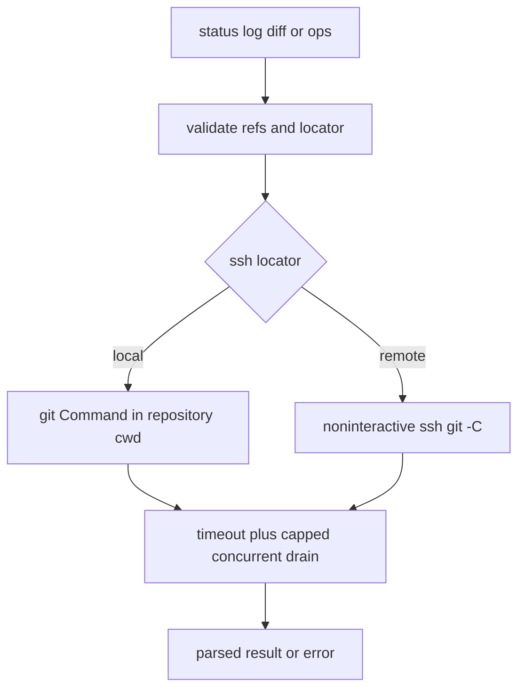

# Git execution engine

`src/git/mod.rs` re-exports the `git` subsystem. Every dynamic Git operation should go through `run_git_cmd`, `run_git_batch`, or `git_command_for` in `src/git/exec.rs`; status, history, diffs, contributors, and operations depend on this boundary.

## Trust and resource controls

`check_safe_ref` rejects leading `-` and control characters. This is required before refs from UI/listing data are passed back to Git, including `apply_stash` and `drop_stash`; it prevents an option-like stash ref or newline-forged remote script argument. `parse_ssh_repo` accepts only `ssh://host/path`: `is_safe_ssh_host` disallows empty/leading-dash hosts and permits only destination characters, because OpenSSH has no `--` option terminator. The path cannot contain controls. Remote shell arguments, including the path, use `shell_quote`; local arguments are direct `Command` args.

Every Git command applies `GIT_CONFIG_ARGS`: `color.ui=never`, `core.fsmonitor=`, `core.sshCommand=ssh`, `uploadpack.packObjectsHook=`, and `protocol.ext.allow=never` (plus output-oriented settings). `with_diff_safety_flags` inserts `--no-ext-diff --no-textconv` immediately after supported diff/log/show subcommands and `--no-textconv` after blame; placement matters because these are subcommand flags. Local commands additionally set `LC_ALL=C`, `LANG=C`, `GIT_TERMINAL_PROMPT=0`, `GIT_OPTIONAL_LOCKS=0`, `GCM_INTERACTIVE=never`, `GIT_ASKPASS=echo`, and pager variables. This prevents repository configuration, attribute drivers, locale variation, prompts, locks, and pagers from corrupting or hanging analysis.

`run_with_timeout` uses `GIT_TIMEOUT` (30 seconds) for analysis and `GIT_NETWORK_TIMEOUT` (120 seconds) for network operations. It starts dedicated stdout/stderr drains before polling `try_wait`: waiting for exit first can deadlock when a pipe fills. `drain_capped` retains at most `MAX_GIT_OUTPUT` (64 MiB) per stream but discards the remainder so the child can still write and exit. On deadline or wait failure it kills and waits for the child, returning an error. After exit it receives drain buffers with only `DRAIN_GRACE` (three seconds), rather than joining threads unboundedly: a grandchild can retain a pipe after its parent exits, so an unbounded join would defeat the timeout.

`run_git_cmd` sanitizes all returned Git text before any parser or UI call site sees it. It preserves tabs and newlines because porcelain uses them as separators, replaces other C0/C1 controls and DEL with a visible `·`, and consumes escape sequences—including OSC payloads—so repository-controlled file content, refs, authors, and messages cannot clear/repaint the terminal or invoke terminal features. `run_git_cmd_ansi` is restricted to the three commit-graph calls: it retains SGR only, which the graph renderer parses, and strips every other escape. SSH batch stdout/stderr passes through the same sanitizer. This central boundary is intentional: do not introduce a raw Git-output path around it.

## Local and SSH execution

For local paths, `git_command_for` runs `git --no-pager` in the repository current directory. For SSH locators it runs noninteractive `ssh` with `BatchMode=yes` and an eight-second connect timeout, then `git -C` remotely. `run_git_batch` falls back to sequential `run_git_cmd` calls locally, but sends remote summary commands through one SSH script/connection. That script reapplies the same config and diff-safety rules, quotes every dynamic argument, merges each command's stderr/stdout, and prints a per-command exit code after a random per-call `batch_sentinel`.

`split_batch_output` returns ordered `Ok(output)` for exit 0 and `Err(output)` for a nonzero command. Missing sentinels after a dropped partial connection are padded as errors; an SSH-level failure produces that error for every requested command. More sentinels than requested is a whole-batch error, not truncation, because repository-controlled output must never forge a boundary and shift results. The nonce makes a delimiter infeasible to predict in commit data or filenames.

Focused tests in `src/git/tests.rs` include `test_git_config_args_disable_executable_hooks`, `test_diff_subcommands_suppress_external_drivers`, `test_parse_ssh_repo_rejects_option_injection`, `test_check_safe_ref_rejects_control_characters`, timeout tests for large output/hung processes, sanitizer tests under `sanitize_tests`, and `test_split_batch_output` variants for mixed outcomes, missing/total failures, and forged delimiters. `tests/integration_tests.rs:test_integration_repository_content_cannot_drive_the_terminal` exercises hostile committed content through the public diff API.

This is the command boundary shared by the higher-level [inspection](repository-inspection.md) and [history/diff](history-and-diffs.md) APIs.

## Change checklist and validation

A new command must use this executor, choose the correct timeout, preserve `--` path separation, and add diff safety flags through `with_diff_safety_flags`. A network write uses `GIT_NETWORK_TIMEOUT` as `pull_repository` and `fetch_repository` do. `src/git/tests.rs` checks ref rejection, flag insertion, SSH parsing/quoting, capped/batched behavior; `tests/integration_tests.rs` exercises the public APIs against temporary real repositories. Run `cargo test --lib git::tests` first, then `cargo test --all-targets`.
