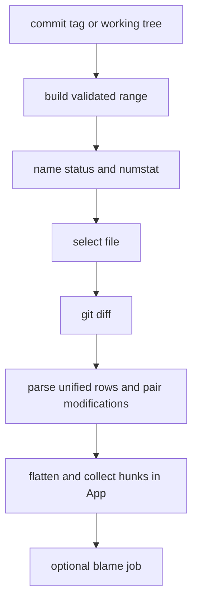

# History, diff, and blame inspection

`src/git/log.rs` turns `git log` into `CommitSummary`, `CommitRef`, `CommitHit`, and `BlameEntry`; `src/git/diff.rs` turns Git diff output into `ChangedFile`, `FileDiff`, and typed `DiffRow`s. `worker` calls these APIs for the Repo and Diff screens.

## History and search

Recent and diff-selectable history uses `--graph --color=always --all`, but `split_graph_and_hash` isolates ANSI graph text so hash, author, date, message, and references remain parseable. `parse_refs` distinguishes HEAD, tag, remote, and local decorations. `search_commits` is case-insensitive literal Git grep (`-i -F`) over all refs; query is embedded in `--grep=<query>` so a leading dash cannot become an option. Cross-repo cap/failure behavior is owned by [background work](../application/background-work.md).

`get_file_blame` omits a revision for `BLAME_WORKING_TREE`, letting Git label uncommitted lines instead of silently blaming HEAD. It safely checks normal refs, retries a `<ref>^` parent form without the caret when needed, caches parsed commit metadata, and caps entries at 20,000.

## Comparison and split rows

`WORKING_TREE` means `HEAD` versus local changes. For commits, `diff_range` produces `base..target`, `base...target` for merge-base style compare, or `target^..target` for a single commit. A root commit cannot resolve its parent; `run_diff` retries exactly that case against Git’s empty tree. Inputs validate refs and pass file paths after `--`.

`get_changed_files` combines `--name-status --find-renames` with `--numstat --find-renames`; quoted and brace-renamed paths are normalized. `get_file_diff` recognizes binary marker lines, parses unified hunks, pairs changed lines as `Modified` only at >=0.5 character similarity, and otherwise retains removal/addition blocks. It caps parsed rows at 2,000 normally or 5,000 full-context rows before calling `syntax::tokenize`.

This is the data flow from repository selection to the three-pane Diff view.

## UI handoff and validation

`FileDiff` keeps token vectors, but `helpers::flatten_diff` currently uses text and row kind to produce `DiffLine`; renderer behavior belongs to [presentation](../presentation/ui-and-localization.md). Diff sequence numbers prevent stale files, blame, or range results from replacing the active view; density toggles preserve scroll using `pending_scroll_restore`.

`src/git/tests.rs` covers range/path/diff parsers and similarity; `src/app/tests.rs` covers hunk and scroll synchronization; `tests/integration_tests.rs` verifies working-tree, root-commit, graph ANSI isolation, and blame behavior with real Git. Use `cargo test --lib git::tests` and `cargo test --test integration_tests`.
