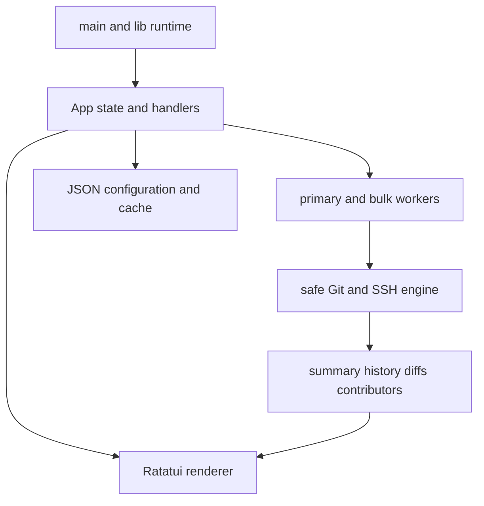

# git-dashboard-tui code wiki

`git-dashboard-tui` is a Rust 2024 terminal dashboard for many local or `ssh://` Git repositories. It builds state from Git CLI output, optionally enriches GitHub repositories through `gh`, and renders an interactive Ratatui UI. The central safety fact is that repository input is untrusted: all Git work must traverse the bounded [Git execution engine](git/engine.md), while ordinary latency-sensitive work must stay off the terminal event loop.

## System map


This is the ownership map implemented by `src/main.rs`, `src/lib.rs`, `src/app`, `src/git`, `src/ui.rs`, and `src/config.rs`.

## Read by concept

- [Runtime architecture and process boundaries](architecture/overview.md): startup, event loop, terminal restoration, shells, and external diff commands.
- [Navigation and interaction state](application/navigation.md): screens, tabs, input/confirm precedence, selection, mouse behavior.
- [Background work and result consistency](application/background-work.md): `Job`/`Msg`, queues, generations/sequences, snapshot cache.
- [Git execution engine](git/engine.md): command safety, SSH, timeouts, output caps—the required starting point for any Git change.
- [Repository inspection and enrichment](git/repository-inspection.md): summaries, conflicts/operations, worktrees, GitHub, technology metadata.
- [History, diff, and blame inspection](git/history-and-diffs.md): graph, comparison ranges, parsers, hunk/blame pipeline.
- [Repository dashboard lifecycle](workflows/dashboard-and-repositories.md): registration/Finder/Home/details/operations.
- [Contributor analytics and cross-repository search](workflows/contributors-and-search.md): aliases, aggregate members, search limits and stale navigation.
- [Persistent configuration and caches](configuration/persistence.md): JSON schemas and compatibility constraints.
- [Terminal rendering, themes, localization, and syntax tokens](presentation/ui-and-localization.md): view boundary and user-visible resources.
- [Testing, CI, releases, and documentation automation](quality/testing-and-ci.md): focused checks and delivery workflows.

## Task routing

| Intent | Primary owner and symbols | Focused tests | Minimum validation |
|---|---|---|---|
| Add/change a Git command | [Git engine](git/engine.md): `run_git_cmd`, `git_command_for`, `run_with_timeout` | `src/git/tests.rs` | `cargo test --lib git::tests` |
| Change Home rows, filters, or repository registration | [Dashboard workflow](workflows/dashboard-and-repositories.md): `refresh_home`, `filtered_home`, `open_repo_finder` | `src/app/tests.rs`, `tests/integration_tests.rs` | `cargo test --lib app::tests` |
| Change screen/key/mouse behavior | [Navigation](application/navigation.md): `App`, `Screen`, handlers | `src/app/tests.rs` | `cargo test --lib app::tests` |
| Change diff/range/blame behavior | [History and diffs](git/history-and-diffs.md): `get_file_diff`, `get_changed_files`, `get_file_blame` | Git and integration tests | `cargo test --test integration_tests` |
| Add async workflow | [Background work](application/background-work.md): `Job`, `Msg`, `apply_msg` | `src/app/tests.rs` | `cargo test --lib app::tests` |
| Add a setting or persisted field | [Persistence](configuration/persistence.md): `Preferences`, save/load methods | `src/config.rs` tests | `cargo test --lib config::tests` |
| Alter UI/theme/translation/token display | [Presentation](presentation/ui-and-localization.md): `ui::draw`, `Palette`, `i18n::t`, `tokenize` | module tests plus manual TUI check | `cargo fmt --check && cargo test --lib` |
| Change CI or release automation | [Quality automation](quality/testing-and-ci.md) | workflow review | `cargo fmt --check && cargo clippy --all-targets -- -D warnings && cargo test --all-targets` |

## Baseline validation

```bash
cargo fmt --check
cargo clippy --all-targets -- -D warnings
cargo test --all-targets
```

## Backlog

No source areas were deferred. One source-defined boundary remains important when changing preferences: `prefs.json` is shared with an external sibling GUI application, so unknown fields may be dropped by either writer; this repository cannot solve that without coordinating the other codebase. See [persistence](configuration/persistence.md) and `src/config.rs`.
