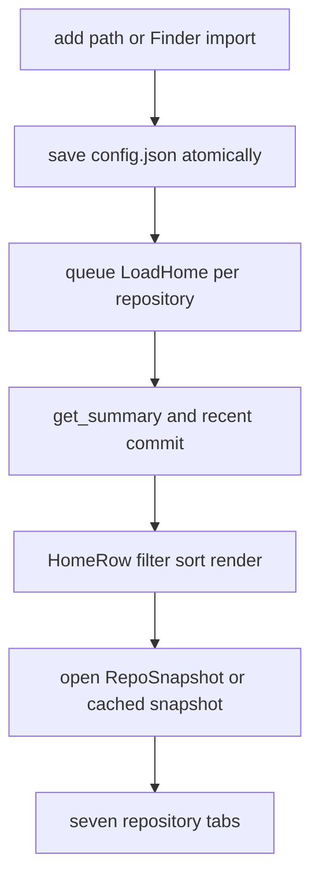

# Repository dashboard lifecycle

A `config::Repository` has a display `name`, `PathBuf path`, and optional group. `App::new` loads these then calls `refresh_home`; one `LoadHome` job per repository produces a `HomeRow` through `get_summary` and recent history. Rendering and interaction are separated: `App` filters/sorts/selects, while `ui::draw_home` displays rows.

This is the primary fleet-to-detail lifecycle.

## Registration, filtering, and refresh

The add prompt sanitizes quoted/escaped paths and supports directory-only Tab completion. `open_repo_finder` calls `find_git_repos(root, 4)`; scanning skips dot directories, `node_modules`, `target`, and `vendor`, and a discovered path is tagged if already registered so imports can avoid duplication. Repository aliases and groups persist via guarded writers.

`filtered_home` combines case-insensitive name/path/group text filtering, group cycling, and `attention_only`; `sort_repo_indices` supports name, last update, branch, dirty-count, and ahead-plus-behind ordering in both directions. `o` cycles all ten modes; clicking a sortable header chooses its primary ordering and reverses the active column on a second click. Renderer-recorded header bounds, rather than duplicated layout arithmetic, drive the click hit test. Modes 0–3 retain their historical meaning because `prefs.json` is shared with the sibling GUI; unknown values fall back to newest-first, and rows that have not loaded sort last for row-derived modes. Needs-attention deliberately means only failed CI, unresolved conflicts, or an interrupted operation—not a dirty tree or behind upstream. Rows with incomplete loading data remain usable and selection is reclamped on asynchronous changes.

Home rows are read from their per-path cache before refresh jobs are queued, then overwritten as fresh results land; this improves first-frame usefulness without treating cached state as truth. Auto refresh runs only on Home and cycles 0/30/60/300 seconds. The default is off because every cycle may invoke two GitHub CLI calls for each GitHub repository. [Background work](../application/background-work.md) owns the cache and stale-result lifecycle.

## Detail and operations

Opening a repository optionally presents `load_tui_cache` immediately and queues `LoadRepo`, whose summary is mandatory but each tab list can fail independently. Status opens working-tree diffs; Commits and Tags select ranges; Branches open an oneline log; Stash supports inspect, apply, and confirmed drop; Contributors changes `TimeSpan`; Worktrees lists metadata and Enter can request a shell in its local directory.

Pull first distinguishes no remote from no upstream tracking branch; fetch only requires a remote. Both invoke the 120-second network timeout and prefer nonempty stderr on failure (otherwise stdout); pull reports nonempty stdout or the localized up-to-date message, while fetch returns its localized success message. `apply_selected_stash` snapshots the selected stash ref into `StashApply`/`StashDrop` jobs, and the worker routes all four writes through `op_done`; stash methods call `check_safe_ref` before Git mutation.

`Msg::OpDone` is the targeted completion contract. Failure becomes `app.error` without refresh. On success, if a repository is open it reloads that repository; otherwise a pull/fetch carrying `Some(repo_index)` refreshes only that Home row; a stash-style completion without identity performs a full Home refresh. This prevents each completed fleet operation from needlessly requeueing every repository. These are writes, unlike interrupted-operation reporting, which the TUI never starts.

For Git command safety and SSH semantics see [Git engine](../git/engine.md); summary fields and GitHub/worktree parsing are in [repository inspection](../git/repository-inspection.md). Shell and external process lifecycle is in [architecture](../architecture/overview.md).

## Validation

Focused unit coverage is in `src/app/tests.rs` for filters, selection, Finder helpers, worker classification, completion routing, cache compatibility, and activity lifecycles. `src/app/helpers.rs:sort_tests` covers every sort column, unloaded-row placement, and unknown-mode fallback; `src/ui.rs:sort_tests` verifies header geometry against rendered columns. `tests/integration_tests.rs:test_integration_stash_workflow` creates a real repository, lists a stash, applies it and asserts the working file changes, drops it, and confirms the list is empty. Pull/fetch completion routing is unit-owned rather than backed by a network integration test. Run `cargo test --lib app::tests` or `cargo test --test integration_tests`; use `cargo test --all-targets` for a dashboard change spanning both layers.
