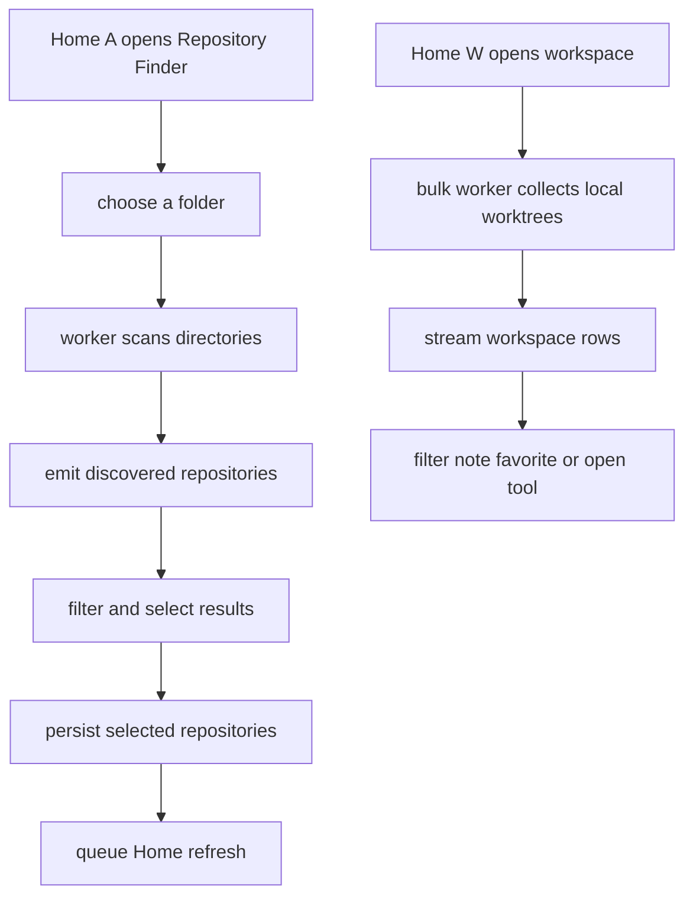

# First-use import, tools, and worktree workspace

The Home screen supports one-path registration (`a`) and folder discovery (`A`). Both persist registered `config::Repository` values through the guarded, atomic configuration writer. The Finder is intended to make an empty installation useful without requiring users to type every repository path; it is not a Git-status scan.


This shows the two incremental fleet workflows; both keep filesystem and Git work off the terminal event loop.

## Repository Finder

`scan_repositories` in `src/app/finder.rs` traverses directories to depth 4 and emits a directory as soon as it finds `.git`; it does not invoke Git for each directory. It canonicalizes paths to avoid cycles and duplicates, checks cancellation between filesystem operations, stops descending after finding a repository, and skips hidden directories plus `node_modules`, `target`, and `vendor`. Read/canonicalization failures are returned as visible collection errors rather than aborting the whole scan.

Finder jobs stream results through the application worker. The application marks a discovery result that matches an existing registration so importing it does not create a duplicate. Replacing or cancelling a scan advances its generation; stale rows and completion messages cannot replace the current Finder state. Path entry sanitizes surrounding quotes and common shell escaping, and Tab completion proposes directories only.

## Tool menu and process constraints

`O` opens a context menu for the selected Home repository or workspace row. It can request a shell, the configured editor, `lazygit`, or `gitui`; editor commands are parsed with `shell_words`, so quoted program paths and arguments remain separate process arguments. `{path}` is substituted in an editor template, or the selected path is appended when no placeholder is present. The editor command and whether the TUI waits for it are saved in `Preferences`.

Local tools require an existing local directory. They are unavailable for repositories registered with an `ssh://` locator, including the workspace collector, because there is no local working directory to pass to a child process. Before execution, `resolve_program` accepts only an existing absolute executable or a bare name found in absolute `PATH`/known tool directories; it rejects slash-containing relative names. That prevents a child whose cwd is a viewed repository from executing a repository-supplied `./tool`. The runtime leaves and restores the TUI around waiting tools, shells, and external diffs; non-waiting GUI editors are spawned without inherited terminal streams. See [runtime architecture](../architecture/overview.md) for terminal restoration details.

After external work returns, `after_external_work` refreshes registrations that match the chosen path directly or after canonicalization. If the current view is a diff, it also reloads its file list; if it is the workspace, it recollects workspace state.

## Cross-repository worktree workspace

Home `W` starts `reload_workspace`. The app snapshots only local registered repositories, counts SSH entries as skipped, and queues `LoadWorkspace` on the bulk worker. `collect_workspace` calls `git::get_worktrees` per registered repository, ignores bare worktrees, canonicalizes each local path, and deduplicates worktrees that appear through more than one registration. For each row it records the parent display name, branch or `(detached)`, dirty-file count, most recent commit date, locked/prunable flags, and an individual error when the status or log read fails. A failure collecting one parent repository is retained separately while healthy rows remain available.

Rows stream while collection runs. A generation number makes cancellation cooperative and prevents old rows or completion from changing newer results; on completion, unseen stale rows are removed and selection is restored by path where possible. Search matches parent, path, branch, and the persisted note. Users can mark a row favorite, filter favorites, set a purpose note, navigate collection errors with `[` and `]`, open the tools menu with Enter, or open a shell at the selected worktree with `t`.

Notes and favorites are stored in `Preferences.worktree_notes`, keyed by the worktree path string. This state is user metadata, not Git worktree configuration. `worktree_dirty` uses NUL-delimited porcelain with `--untracked-files=all` and counts rename/copy records once, so individual untracked files are included without being confused by newlines in filenames.

## Validation and extension checklist

`src/app/finder.rs` tests streaming, exclusions, cancellation, and scan errors. `src/app/tools.rs` tests editor argument parsing and SSH rejection. `src/app/workspace.rs` tests stale workspace results, note/favorite filtering, local-worktree deduplication, cancellation, dirty counting, rename handling, and newline-containing filenames. Run:

```bash
cargo test --lib app::tests
cargo test --all-targets
```

When extending discovery or workspace collection, preserve incremental emission, cooperative cancellation, generation checks, and per-parent/per-row error visibility. When adding a tool, preserve literal argument passing, safe program resolution, local-directory validation, and the runtime restoration contract.
